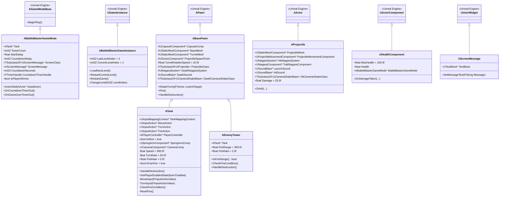
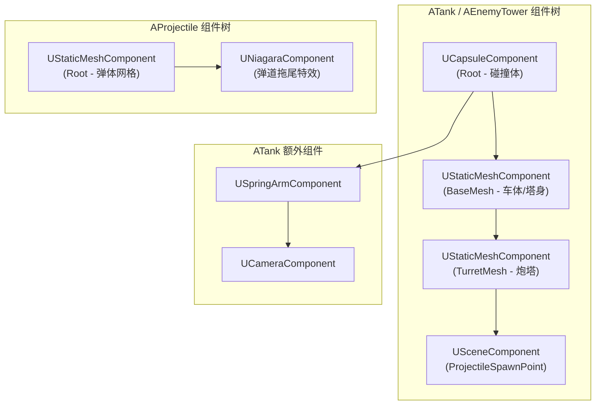
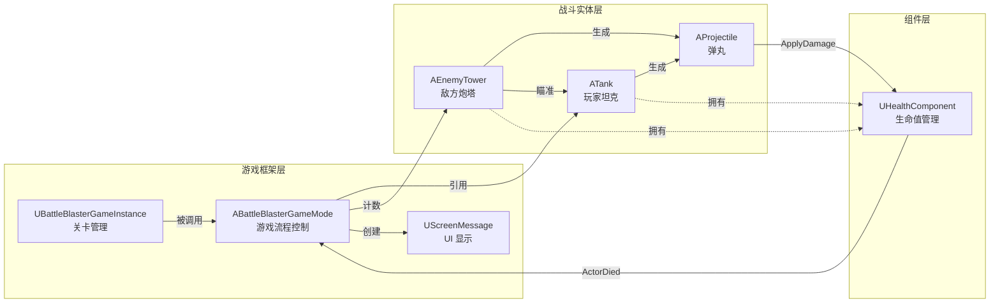
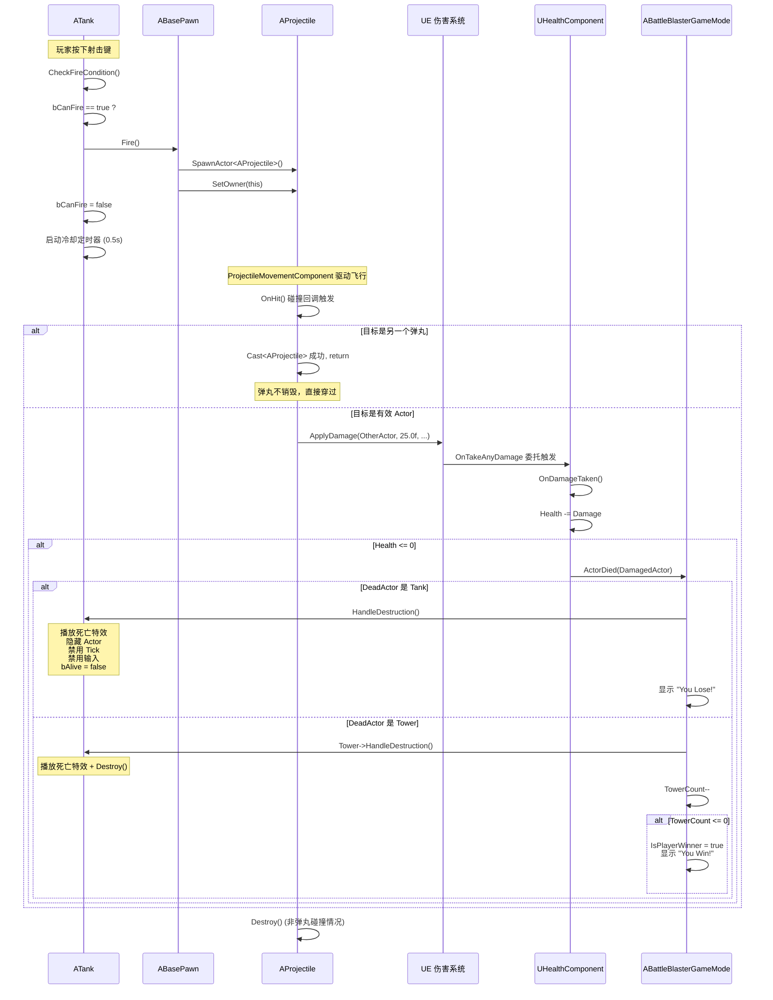
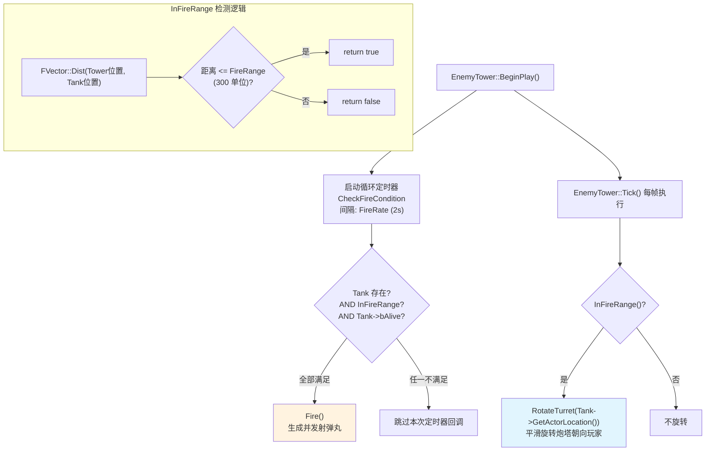
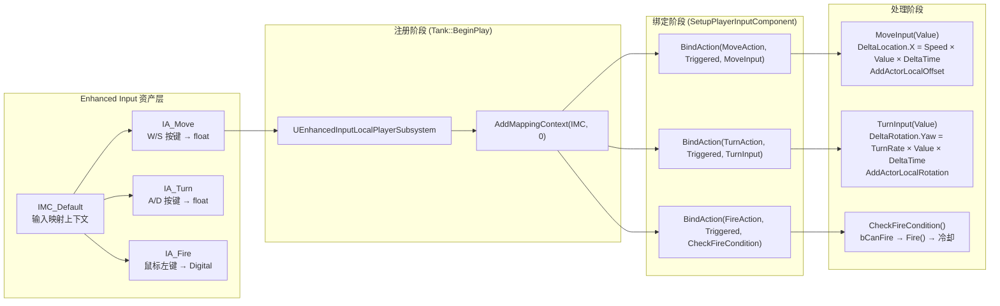
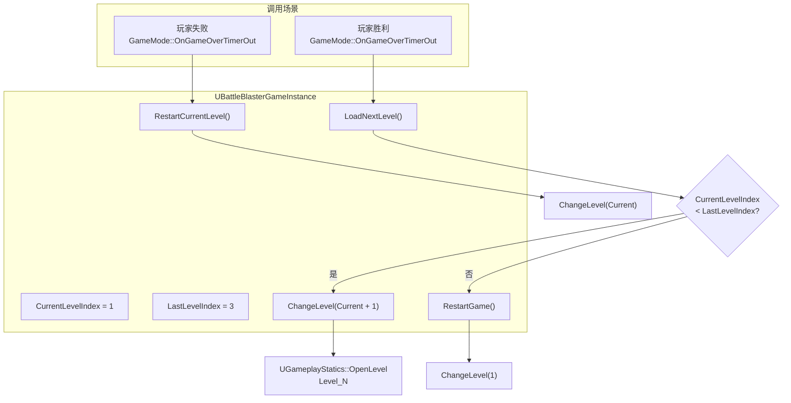
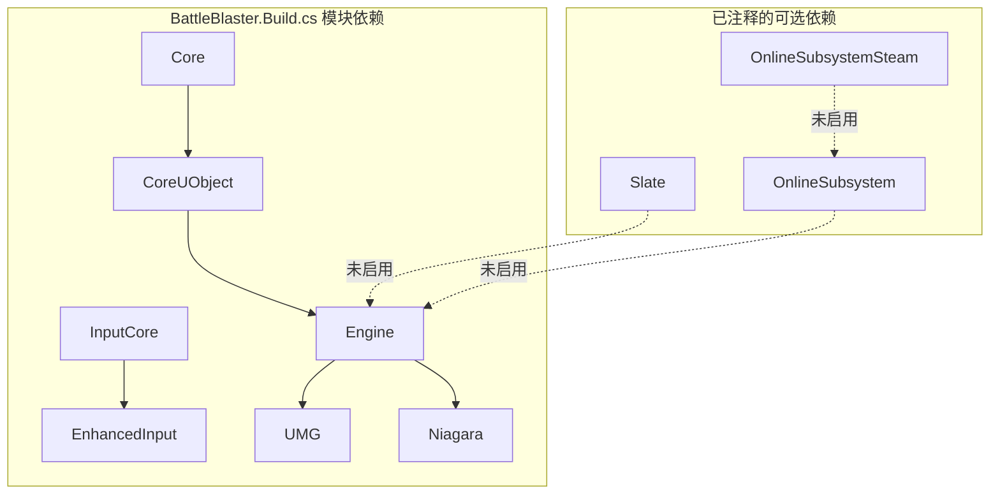
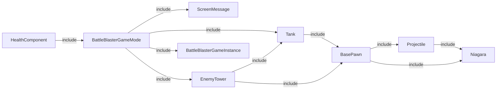

# BattleBlaster 项目设计文档

> **引擎版本**: Unreal Engine 5.6
> **项目类型**: 单人坦克对战游戏
> **核心语言**: C++ + Blueprint
> **代码规模**: 18 个 `.h/.cpp` / 1023 行（统计口径：`Source/` 下全部 `.h` + `.cpp`，排除 `Intermediate/`；其中 8 个玩法类占 16 文件 1011 行）
> **文档版本**: v2.0
> **文档更新日期**: 2026-09-15
> **仓库**: https://github.com/MoonRainMelody/BattleBlaster（含 Content，克隆后可直接运行）

> **维护约定**：本文档描述**当前代码**。位置一律用「文件 + 符号」引用而不用行号——行号会随改动漂移，符号不会。凡与代码不一致之处以代码为准，并请直接更新本文档（文末有变更记录）。

---

## 1. 项目概览

### 1.1 游戏简介

BattleBlaster 是一款基于 Unreal Engine 5.6 的单人坦克战斗游戏。玩家控制一辆坦克，在 3 个关卡中消灭所有敌方炮塔。游戏采用第三人称俯视角视角，使用鼠标瞄准 + WASD 移动的操控方案。

### 1.2 核心玩法

- **移动**: WASD 控制坦克前后移动和左右转向
- **瞄准**: 鼠标控制炮塔朝向
- **射击**: 左键发射炮弹，有 0.5 秒冷却
- **胜利条件**: 消灭当前关卡所有敌方炮塔
- **失败条件**: 玩家坦克被摧毁
- **关卡流程**: 通过后自动加载下一关，3 关全通后循环重开

### 1.3 技术栈

| 类别 | 技术 |
|------|------|
| 引擎 | Unreal Engine 5.6 |
| 核心模块 | Core, CoreUObject, Engine, InputCore |
| 输入系统 | Enhanced Input System |
| UI 框架 | UMG (Unreal Motion Graphics) |
| 粒子系统 | Niagara |
| 音频 | 内置音频系统 |
| 物理碰撞 | 自定义碰撞通道 (Projectile) |

---

## 2. 类继承体系



---

## 3. 组件层级结构

### 3.1 坦克/炮塔组件树 (BasePawn 子类)



---

## 4. 系统架构总览

### 4.1 各模块职责

| 模块 | 文件 | 职责 |
|------|------|------|
| **GameMode** | `BattleBlasterGameMode.h/cpp` | 游戏流程控制：倒计时、胜负判定、关卡切换调度 |
| **GameInstance** | `BattleBlasterGameInstance.h/cpp` | 跨关卡持久化：关卡索引管理、关卡加载/重启 |
| **BasePawn** | `BasePawn.h/cpp` | 战斗基础：炮塔旋转插值、弹丸生成、死亡特效 |
| **Tank** | `Tank.h/cpp` | 玩家控制：Enhanced Input 绑定、鼠标瞄准、射击冷却 |
| **EnemyTower** | `EnemyTower.h/cpp` | AI 行为：范围检测、自动瞄准、定时射击 |
| **Projectile** | `Projectile.h/cpp` | 弹丸系统：碰撞检测、伤害施加、命中特效 |
| **HealthComponent** | `HealthComponent.h/cpp` | 生命值管理：伤害接收、死亡通知 |
| **ScreenMessage** | `ScreenMessage.h/cpp` | UI 消息：屏幕文字显示 |

### 4.2 模块交互关系



---

## 5. 游戏生命周期流程

```mermaid
stateDiagram-v2
    [*] --> LevelLoaded: Open Level_N
    LevelLoaded --> BeginPlay: GameMode::BeginPlay()
    BeginPlay --> ShowReady: 显示 "Get Ready!"
    ShowReady --> Countdown: 启动循环定时器 (1s)

    state Countdown {
        [*] --> Tick3: CountdownSeconds = 3
        Tick3 --> Tick2: 显示 "2"
        Tick2 --> Tick1: 显示 "1"
        Tick1 --> Go: 显示 "Go!!"
        Go --> EnableInput: 启用玩家输入
        EnableInput --> HideWidget: 隐藏 UI, 清除定时器
    }

    Countdown --> Gameplay: 玩家可操作
    Gameplay --> ActorDied: 任意 Actor 死亡

    state ActorDied {
        [*] --> CheckDead
        CheckDead --> TankDead: DeadActor == Tank
        CheckDead --> TowerDead: DeadActor == Tower

        TankDead --> ShowLose: "You Lose!"
        TowerDead --> CheckTowers: TowerCount--
        CheckTowers --> ShowWin: TowerCount <= 0
        CheckTowers --> Gameplay: 还有存活炮塔
    }

    ShowWin --> TransitionDelay: 等待 StartDelay 秒
    ShowLose --> TransitionDelay
    TransitionDelay --> NextLevel: 玩家胜利
    TransitionDirection --> RestartLevel: 玩家失败

    NextLevel --> LevelLoaded: CurrentLevel < 3
    NextLevel --> RestartGame: CurrentLevel == 3
    RestartLevel --> LevelLoaded: 重新加载当前关
    RestartGame --> LevelLoaded: 重置到 Level_1
```

---

## 6. 战斗/伤害管线



---

## 7. AI 行为流程



---

## 8. 输入处理流程



### 8.1 关键输入参数

| 动作 | 按键 | 值类型 | 处理函数 | 效果 |
|------|------|--------|----------|------|
| IA_Move | W/S | float | MoveInput | 前后移动 (Speed=300) |
| IA_Turn | A/D | float | TurnInput | 左右转向 (TurnRate=50) |
| IA_Fire | 鼠标左键 | Digital | CheckFireCondition | 发射弹丸 (冷却0.5s) |

### 8.2 鼠标瞄准

坦克炮塔通过每帧 `GetHitResultUnderCursor(ECC_Visibility)` 获取鼠标指向的世界坐标，再通过 `RotateTurret` 使用 `FMath::RInterpTo` 进行平滑旋转。

---

## 9. 关卡管理系统



---

## 10. 设计模式总结

### 10.1 使用的设计模式

| 模式 | 应用位置 | 说明 |
|------|----------|------|
| **组件组合** | `UHealthComponent` | 将生命值逻辑从 Pawn 解耦，任何 Actor 都可挂载 |
| **模板方法** | `ABasePawn::HandleDestruction()` | 基类提供死亡特效/音效/震屏，派生类添加特定逻辑 |
| **观察者/委托** | `OnTakeAnyDamage → OnDamageTaken` | 事件驱动的伤害通知，无需紧耦合 |
| **隐式状态机** | `GameMode` 倒计时/游戏/结束 | 通过定时器回调和布尔标志管理隐式状态 |
| **Owner 模式** | `Projectile->SetOwner(this)` | 弹丸记住发射者，用于伤害归因和自伤过滤 |
| **继承多态** | `BasePawn → Tank / EnemyTower` | 共享战斗逻辑在基类，特定行为在派生类 |
| **全局访问** | `UGameplayStatics::GetGameMode()` | 从任意 Actor 获取 GameMode 引用 |
| **策略模式(隐式)** | Tank 用光标瞄准 vs Tower 用距离检测 | 都调用 `RotateTurret` 但目标计算策略不同 |

### 10.2 模式权衡分析

**继承 vs 组合**：
- 当前 BasePawn 用继承抽取共享逻辑（Fire、RotateTurret、HandleDestruction）
- HealthComponent 用组合实现跨 Actor 复用
- 如果 Tank 和 Tower 行为进一步分化，可考虑将 Fire/RotateTurret 也抽取为组件

**事件驱动 vs 直接调用**：
- 伤害管线使用了 UE 内置委托机制（OnTakeAnyDamage）
- HealthComponent 死亡时直接调用 GameMode（紧耦合）
- 更优方案：HealthComponent 广播 `OnDeath` 委托，GameMode 订阅

---

## 11. 定时器使用清单

| 所属类 | TimerHandle | 回调函数 | 间隔 | 循环 | 用途 |
|--------|-------------|----------|------|------|------|
| `ABattleBlasterGameMode` | `CountdownTimerHandle`（成员） | `OnCountdownTimerOut` | 1.0s | 是 | 倒计时 3-2-1-Go |
| `ABattleBlasterGameMode` | `GameOverTimerHandle`（`ActorDied` 内局部） | `OnGameOverTimerOut` | `StartDelay`（默认 3.0s） | 否 | 游戏结束后延迟切关 / 重开 |
| `ATank` | `FireRateTimerHandle`（成员） | `ResetFire` | `FireRate`（默认 0.5s） | 否 | 射击冷却解锁 |
| `AEnemyTower` | `FireRateTimerHandle`（成员） | `CheckFireCondition` | `FireRate`（默认 2.0s） | 是 | AI 定时射击检查 |

> **注意（2026-09-15 复核）**：`AEnemyTower` 的句柄**已从 `BeginPlay` 局部变量改为成员**（`EnemyTower.h` 的 `FTimerHandle FireRateTimerHandle`），并在 `AEnemyTower::HandleDestruction` 中先 `ClearTimer` 再 `Destroy()`，避免"隐藏/销毁后定时器仍在回调"。目前唯一仍是局部句柄的是 `ABattleBlasterGameMode::ActorDied` 里的 `GameOverTimerHandle`——它是一次性定时器，无需取消，故可接受；若将来要支持"结算前取消"，需改为成员句柄。


---

## 12. 模块依赖关系



### 12.1 头文件依赖关系



---

## 13. 架构问题与技术债

> **本节已于 2026-09-15 按当前代码逐条复核**：原 13.1 列出的"裸指针 / 局部定时器 / 未使用变量"在**内存与生命周期治理**中已全部修复，因此拆成「已修复」与「仍存在」两部分；所有位置改为「文件 + 符号」引用。

### 13.1 已修复（保留记录，便于回溯问题与修复方式）

| 原问题 | 位置（符号） | 修复方式 |
|------|------|----------|
| Tower 持有裸指针 `ATank*`，GC 不追踪、可能悬空 | `EnemyTower.h` → `Tower::Tank` | 改为 `UPROPERTY() TObjectPtr<ATank> Tank`，并加注释说明风险来源；`InFireRange()` 中仍保留 `if (Tank)` 判空 |
| GameMode 持有裸指针 `ATank*` | `BattleBlasterGameMode.h` → `ABattleBlasterGameMode::Tank` | 同上改为 `UPROPERTY() TObjectPtr<ATank>`；`ScreenMessage` 也补了 `UPROPERTY()` |
| `BasePawn::Fire` 中未使用的 `AActor* ProjectileOwner` | `BasePawn.cpp` → `ABasePawn::Fire` | 已删除该局部变量，只保留 `Projectile->SetOwner(this)` |
| Tower 的 `FTimerHandle` 是 `BeginPlay` 局部变量，无法清除/暂停 | `EnemyTower.h` → `FireRateTimerHandle` | 改为成员句柄；`AEnemyTower::HandleDestruction` 中 `ClearTimer` 后再 `Destroy()` |
| `HandleDestruction` 里未判空玩家控制器 | `BasePawn.cpp` → `ABasePawn::HandleDestruction` | 相机抖动改为先取 `GetFirstPlayerController()` 判空，专用服务器/无本地玩家时跳过 |

### 13.2 仍存在：性能问题

| 问题 | 位置（符号） | 严重程度 | 说明 |
|------|------|----------|------|
| Projectile 空 Tick | `AProjectile::Tick` + 构造函数 `PrimaryActorTick.bCanEverTick = true` | 低 | Tick 体只有 `Super::Tick()`；弹丸靠 `UProjectileMovementComponent` 移动，可整体关闭 Tick |
| HealthComponent 空 Tick | `UHealthComponent::TickComponent` + 构造函数 `PrimaryComponentTick.bCanEverTick = true` | 低 | 同上；在"大量弹丸同时存在"的场景下是纯浪费 |
| BasePawn 无 Tick 却开启 Tick | `ABasePawn` 构造函数 `PrimaryActorTick.bCanEverTick = true` | 低 | `ABasePawn` 自身没有 Tick 重写，该标志只对 `ATank` / `AEnemyTower` 有意义 |
| `Tank::Tick` 每帧做光标命中检测 | `Tank.cpp` → `ATank::Tick`（`GetHitResultUnderCursor`） | 中 | 每帧一次屏幕→世界射线；单坦克场景可接受，若要优化可降到固定频率或仅在鼠标移动时执行 |

### 13.3 仍存在：设计耦合与健壮性

| 问题 | 位置（符号） | 严重程度 | 说明 |
|------|------|----------|------|
| HealthComponent 硬依赖具体 GameMode | `HealthComponent.h` → `TObjectPtr<ABattleBlasterGameMode> BattleBlasterGameMode`（`BeginPlay` 中 `Cast` 赋值） | 高 | 组件无法在别的 GameMode 下复用；改为广播 `OnDeath` 委托 + GameMode 订阅即可解耦 |
| 无死亡防护标志 | `UHealthComponent::OnDamageTaken` | 中 | 血量归零后仍可继续扣血，`ActorDied` 可能被多次调用 → `TowerCount` 重复自减、胜负判定被污染 |
| 血量无下限钳制 | `UHealthComponent::OnDamageTaken` 中 `Health -= Damage` | 低 | `Health` 可变为任意负数；应对 `Health` 做 `Clamp(0, MaxHealth)` |
| 弹丸互撞后双方都不销毁 | `Projectile.cpp` → `AProjectile::OnHit` 中的 `if (HitProjectile) return;` | 中 | 两枚弹丸相撞会互相穿过继续飞行；只有撞到非弹丸目标才会 `Destroy()` |
| GameOver 定时器为局部句柄 | `BattleBlasterGameMode.cpp` → `ABattleBlasterGameMode::ActorDied` | 低 | 一次性定时器，无取消需求；若要"结算前取消"需改成员句柄 |
| `ActorDied` 无倒计时阶段守卫 | `BattleBlasterGameMode.cpp` → `ABattleBlasterGameMode::ActorDied` | 低 | 若倒计时期间因其他伤害源触发死亡，会直接进入结算流程（当前玩法下不可达） |

### 13.4 仍存在：代码质量

| 问题 | 位置（符号） | 严重程度 | 说明 |
|------|------|----------|------|
| 访问修饰符不一致 | `Tank.h` 的 `protected:` 段（`FireRate` / `bCanFire` / `FireRateTimerHandle`） | 低 | 三者都只在本类内使用，逻辑上应为 `private` |
| 遗留调试代码 | `BasePawn.cpp` → `ABasePawn::Fire` 中被注释掉的 `DrawDebugSphere` | 低 | 建议删除 |
| 重复蓝图资产 | `Content/BluePrints/BP_BattleBlasterGameMode.uasset` 与 `Content/GameMode/BP_BattleBlasterGameMode.uasset` | 中 | 同名两份，实际生效的是 `GameMode/` 下那份（见附录 `GlobalDefaultGameMode`）；`BluePrints/` 下那份为冗余副本，建议删除以免误引用 |


---

## 14. 内容资源清单

### 14.1 关卡

| 资源 | 路径 | 说明 |
|------|------|------|
| Main | `/Content/Maps/Main.umap` | 主菜单地图 |
| Level_1 | `/Content/Maps/Level_1.umap` | 第一关（默认启动关卡） |
| Level_2 | `/Content/Maps/Level_2.umap` | 第二关 |
| Level_3 | `/Content/Maps/Level_3.umap` | 第三关 |

### 14.2 蓝图

| 资源 | 路径 | 说明 |
|------|------|------|
| BP_Tank | `/Content/BluePrints/BP_Tank.uasset` | 玩家坦克蓝图 |
| BP_Tower | `/Content/BluePrints/BP_Tower.uasset` | 敌方炮塔蓝图 |
| BP_Projectile | `/Content/BluePrints/BP_Projectile.uasset` | 弹丸蓝图 |
| BP_CameraShake | `/Content/BluePrints/BP_CameraShake.uasset` | 摄像机震动 |
| BP_DeathShake1 | `/Content/BluePrints/BP_DeathShake1.uasset` | 死亡震动 |
| BP_BattleBlasterGameMode | `/Content/GameMode/BP_BattleBlasterGameMode.uasset` | 游戏模式蓝图（**实际生效**，见附录 `GlobalDefaultGameMode`） |
| BP_BattleBlasterGameInstance | `/Content/BluePrints/BP_BattleBlasterGameInstance.uasset` | 游戏实例蓝图 |
| WBP_ScreenMessage | `/Content/BluePrints/WBP_ScreenMessage.uasset` | 屏幕消息 UI 控件 |

> ⚠️ **重复资产**：`/Content/BluePrints/BP_BattleBlasterGameMode.uasset` 是早期副本，与生效的 `GameMode/` 版本同名不同内容（20,388 B vs 21,904 B），已在 13.4 记为技术债，建议删除。

### 14.3 网格体

| 资源 | 说明 |
|------|------|
| SM_TankBase | 坦克底盘 |
| SM_TankTurret | 坦克炮塔 |
| SM_TowerBase | 炮塔底座 |
| SM_TowerTurret | 炮塔头 |
| SM_Projectile | 弹丸 |
| SM_Sphere | 基础球体 |

### 14.4 特效与音频

| 资源 | 说明 |
|------|------|
| P_DeathEffect | 死亡粒子效果 |
| P_HitEffect | 命中粒子效果 |
| P_ProjectileTrail | 弹道拖尾效果 |
| Explode_Audio | 爆炸音效 |
| Thud_Audio | 撞击音效 |

### 14.5 输入资产

| 资源 | 说明 |
|------|------|
| IMC_Default | 默认输入映射上下文 |
| IA_Move | 移动动作 (W/S) |
| IA_Turn | 转向动作 (A/D) |
| IA_Fire | 射击动作 (鼠标左键) |

### 14.6 材质与纹理

| 类型 | 路径 | 说明 |
|------|------|------|
| 基础材质 | `/Content/Assets/Materials/Base/` | 基础材质和材质函数 |
| 发光材质 | 绿色/红色变体 | 发光效果材质 |
| T_BasicGrid_M | 基础网格遮罩 | 纹理贴图 |
| T_BasicGrid_N | 基础网格法线 | 法线贴图 |
| T_ColourGrid | 颜色网格 | 色彩纹理 |

---

## 附录: 引擎配置要点

### DefaultEngine.ini 关键设置

| 配置项 | 值 | 说明 |
|--------|-----|------|
| GameInstance Class | `/Game/BluePrints/BP_BattleBlasterGameInstance.BP_BattleBlasterGameInstance_C` | 游戏实例蓝图类（负责关卡进度） |
| Default GameMode | `/Game/GameMode/BP_BattleBlasterGameMode.BP_BattleBlasterGameMode_C` | 默认游戏模式蓝图类（**注意在 `GameMode/` 目录，不是 `BluePrints/`**） |
| GlobalDefaultServerGameMode | `None` | 无专用服务器 GameMode |
| Editor Startup Map | `/Game/Maps/Level_1` | 编辑器启动地图 |
| Local Map Options（GameDefaultMap） | `/Game/Maps/Level_1` | 游戏默认启动地图 |
| Gravity（DefaultGravityZ） | -980 | 标准重力 |
| Terminal Velocity | 4000 | 终端速度 |
| bUseSplitscreen | True | 引擎默认开启分屏，本项目未使用（单人玩法） |

---

## 附录 B: 文档变更记录

| 版本 | 日期 | 说明 |
|---|---|---|
| v1.0 | 2026-06-08 | 初版：类继承体系、组件层级、系统架构、生命周期、战斗与伤害管线、AI、输入、关卡、设计模式、定时器清单、依赖关系、已知问题、内容资源清单 |
| v2.0 | 2026-09-15 | 按当前代码全面复核并更新：① 第 13 章拆分为「已修复」与「仍存在」，把内存与生命周期治理的 5 项修复如实记录，新增 4 项现存问题（`Tank::Tick` 每帧光标检测、`ActorDied` 无倒计时守卫、重复蓝图资产、遗留调试代码）；② 全文位置引用从**行号**改为**文件 + 符号**（原 4 处行号已因改动漂移）；③ 第 11 章定时器清单更正 `AEnemyTower` 句柄为成员并说明清理时机；④ 第 14.2 节更正 GameMode 蓝图实际路径并标注重复资产；⑤ 附录补充 `GlobalDefaultServerGameMode`、`bUseSplitscreen` 与配置项的真实取值来源；⑥ 文档头补充代码规模与仓库链接 |

